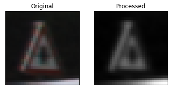
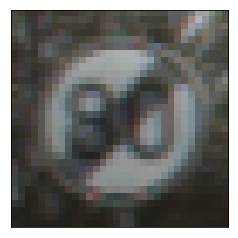

# **Traffic Sign Recognition Writeup** 

---

## Table of Contents
<ul>
    <li><a href="#intro">Introduction</a></li>
    <li><a href="#eda1">Dataset Summary & Exploration</a></li>
    <li><a href="#eda2">Exploratory Visualization of Dataset</a></li>
    <li><a href="#preprocess">Data Preprocessing</a></li>
    <li><a href="#architecture">Model Architecture</a></li>
    <li><a href="#training">Model Training</a></li>
    <li><a href="#testing">Testing on New Images</a></li>
</ul>

<a id="intro"></a>
## Introduction
___

To meet specifications, the project will require submitting three files: 
* the Ipython notebook with the code
* the code exported as an html file
* a writeup report either as a markdown or pdf file 

** idea: try modifying the datasets such that all classes occur equally in each. Simply removing from each set would result in decreased training, which should theoretically result in poorer performance. However, perhaps the classifier was overtraining on several, if not all, of the more common classes so it is not unreasonable to hypothesize that perhaps performance of the classifier will improve. Let's test this hypothesis.

In the following, we'll attempt to design a convolutional neural network to classify traffic signs. We'll use data originally obtained from the [German Traffic Sign Recognition Benchmark](http://benchmark.ini.rub.de/?section=gtsrb&subsection=news) and base our model on the that described by Sermanet and LeCun ([2011](http://yann.lecun.com/exdb/publis/pdf/sermanet-ijcnn-11.pdf)).

<a id="eda1"></a>
## Data Set Summary & Exploration
___

The dataset used consists of 51,839 images of German traffic signs. I used the pandas library to calculate summary statistics of the dataset:

* The size of training set is 34,799
* The size of the validation set is 12,630
* The size of test set is 12,630
* The shape of a traffic sign image is 32, 32, 3)
* The number of unique classes/labels in the data set is 43

<a id="eda2"></a>
## Exploratory visualization of the dataset.
___
Here is an exploratory visualization of the data set. It is a bar chart showing how the data ...


Each image class takes up a similar amount of the sets. The proportion of the train set that is made up by each image is similar to that of the test set, so the performance on the test set will be reflective of that on the train set. However, there is a relatively large difference between proportions in the test set and those in the validation set, so performance on the validation set may not be strongly reflective of performance on the train set. That is, a model that performs well on one set may not perform well on the other set. To be fair, the trends appear similar - i.e., images relatively common in the train set are also relatively common in the validation set and images relatively rare in the train set are relatively rare in the validation set, so somewhat of a degree of reflectivity between performance on each set should still be expected. Also, perfect ratio equivalence suggests a lack of randomness.

The fact that some images are more prevalent in each set (e.g., train, valid, test) suggests that a model trained on these sets will be better at classifying certain images than at classifying other images. For instance, the model will receive much training on class 13 and far less training on class 0 and so will be better at classifying images of the former class, and less proficient at classifying images of the latter class.

Here is a visualization of a sign of class 13 and a sign of class 0. These images are from the test set, `X_test`

Class 13 (higher prevalence in all sets):


Class 0 (lower prevalence in all sets):


The statistics of the representation of each class in each dataset are such that the corresponding average proportions are each close to 0.0232 ($\frac{1}{43} \approx 0.0232558$) so the mean of the sample means approaches what we would expect of the population mean if the data is randomly sampled, among other conditions. The former does not imply the latter, but if the the former did not hold (i.e., we did not see this phenomenon regarding the representation means), it would be grounds for an argument that the data is not random. Although we cannot make definitive conclusions about randomness, it is relieving to see that despite great apparent variation (e.g., the standard deviation exceeds the median), no proportions drop below 4.75%.

Ensuring equal representation could theoretically promote training a classifier that generalizes better to unseen data, but could also hurt. Specifically, if we ensured equal representation by subtracting data, we would decrease the overall amount of training available to the classifier and intuitively, this would have a negative effect on performance. It is also conceivable that performance would decrease if we only modified one dataset, such that we train on unbiased data and test with biased data, or vice versa. Thus, I decided to move forward but to test the effects of both indiscriminate and discriminate enlargening.

<a id="preprocess"></a>
## Data Preprocessing
___

####1. Describe how you preprocessed the image data. What techniques were chosen and why did you choose these techniques? Consider including images showing the output of each preprocessing technique. Pre-processing refers to techniques such as converting to grayscale, normalization, etc.

####(OPTIONAL: As described in the "Stand Out Suggestions" part of the rubric, if you generated additional data for training, describe why you decided to generate additional data, how you generated the data, and provide example images of the additional data. Then describe the characteristics of the augmented training set like number of images in the set, number of images for each class, etc.)

In their work, Sermanet and LeCun ([2011](http://yann.lecun.com/exdb/publis/pdf/sermanet-ijcnn-11.pdf)) found performance was superior in the YUV color space. Specifically, they claimed to use YUV channels or Y only. In their work, they concluded that their network "could have clearly benefitted for color information for the worst errors... where an arrow is hardly visible in grayscale but clearly is in color channels. We however showed that non-normalized color yielded overall worse performance." Including color may rectify some prediction errors but also inspire a larger amount of errors on other problems.

Thus, I extracted data in the Y channel of each image (equivalent to not using color). In addition, in order for better performance to be achieved, I did the following to prepare data:
* Normalize the images
* Apply Gaussian smoothing

In order for better performance to be achieved, the model should not be trained on possibly different ranges of values (e.g., representative of a badly lit sign and of a well lit sign). It does not seem advisable to use lighting, color saturation, etc. as predictive features. The image data should be normalized so that the data has mean zero and equal variance. For image data, $\frac{pixel - 128}{128}$ is a quick way to approximately normalize the data. This is the first step that we'll take. The y values will not be altered.

Further, noise can have a negative effect on classification so I also thought it could be beneficial use the GaussianBlur() function to smooth the images (i.e., counteract noise). Admittedly, classification by neural networks is negatively impacted by blur, perhaps because blur obviates texture, as is posited by [Doge and Karam (2016)](https://arxiv.org/pdf/1604.04004.pdf). Textures should not be much of a concern in the task at hand, but this hypothesis may be incorrect, so I used a smaller kernel size and a smaller standard deviation in the X direction.

Let's start by looking at the effects of this on a single image.

Here is an example of a traffic sign image before and after grayscaling and using the aforementioned method of normalization ($\frac{pixel - 128}{128}$).


Clearly, that method of normalization was not ideal, as the sign no longer appeared the same.

Thus, I sought an alternative. The `equalizeHist` function looked promising, as did the `normalize` function (both in the `cv2` module). The following shows a few trials comparing the two.


Regardless of the method, the images consistently looked better with some sort of normalization. In some cases, the image looked better when `cv2.normalize` is used whereas in other cases, the image looked better when `cv2.equalizeHist` is used. The choice of one over another is not clear. It seemed that `cv2.normalize` was the safer option, though, so I used that method henceforth.

I next considered the addition of blur in the above images (e.g., the images used for comparing `cv2.equalizeHist` and `cv2.normalize` also contained Gaussian blur.

The blurring appeared not to have a positive effect. It was difficult to decide, however, if this tradeoff is greater than the benefit of reduced potential noise. This decision had to be be evaluated with further information. I retained the method for now but with the understanding that I may have to further consider this down the line. I later found that such blurring reduced prediction performance, though, so I decided not to add Gaussian blur.

The following exemplifies these modifications on a larger set of images. No issues were immediately apparent so this preprocessing seemed acceptable.





I later also decided to generate additional data based on the claim by Sermanet and LeCun (2011) that doing so resulted in increased performance.

I used the following function to add random noise:


```python
def addNoise(img, amount):
    l, w, d = img.shape

    # Limiting noise so much seems harsh, but the classifier stayed at around 0.056-0.059%
    #  accuracy on the training set and 0.40-0.50% accuracy on the validation set for
    #  several epochs even when the upper bound for noise was anywhere from 1 to 10, or
    #  more.This is slightly better than chance (approximately 2/43 as opposed to 1/43),
    #  but no improvement was seen after over a number of epochs in each case.
    noise = np.random.randint(0, amount, (l,w))
    jitter = np.zeros_like(img)
    jitter[:,:,1] = noise

    processed_img = cv2.add(img, jitter)
    
    return processed_img
```


The following is the result of adding noise (e.g., jittering) to a given image with an upper bound on the amount of noise of 25 and 5, respectively.


Unfortunately, even the slightest bit of noise (i.e., `amount = 1` rendered the model useless. Training accuracy was above chance (random guessing: $\frac{1}{43} \approx 2.326%$), but remained consistently low at around 5.8%, even throughout 250 steps of training. Thus, the `addNoise` function may have looked correct, but was not used.

I next added random alterations in image position, but unlike Sermanet and LeCun (2011), the amount of alteration was an integer in [1, 5].

By altering an image position, I mean that I shifted the entire image in a certain direction and padded the vacated space with fluff (e.g., 0's).

The following is the function I wrote and used.


```python
def alterPos(img):
    altered = np.zeros_like(img)
    
    direction = np.random.randint(1,5)
    amt = np.random.randint(1,6)

    # There is no block that begins with 'if direction == 0:' because
    #  we always want some degree of alteration
    if direction == 1:
        for i in range(2):
            altered[amt:,:,i] = img[:32-amt,:,i]
    elif direction == 2:
        for i in range(2):
            altered[:32-amt,:,i] = img[amt:,:,i]
    elif direction == 3:
        for i in range(2):
            altered[:,amt:,i] = img[:,:32-amt,i]
    elif direction == 4:
        for i in range(2):
            altered[:,:32-amt,i] = img[:,amt:,i]
    return altered
```

The following are examples of this function being used on single images.


The colors changed too, but since I was using the same array of numbers in numpy, with some numbers substituted with zero, I saw no cause for concern.

I finally sought to add some degree of rotation to the images. As with Sermanet and LeCun's (2011) statement, I limited rotation to a value in [-15, +15] degrees.

Here is the function I designed and used.


```python
def rotate(img):
    (l,w) = img.shape[:2]
    center = (w/2, l/2)
    amt = np.random.uniform(low=-30, high=30)
    while not amt:
        amt = np.random.uniform(low=-30, high=30)
    rotMatrix = cv2.getRotationMatrix2D(center, amt, 1.)
    processed_img = cv2.warpAffine(img, rotMatrix, (w, l))
    return processed_img
```

Here are some examples of using this function on single images.


Finally, I saw that `X_train` appeared to consist of a vast number of variations on a single image of a single sign, as in the following.


Thus, I decided that the data should be shuffled in order for more effective training. I used the `shuffle` function from `sklearn.utils` as follows:

```{python}
from sklearn.utils import shuffle
X_train, y_train = shuffle(X_train, y_train)
```

In the end, this was my function for processing images:

```{python}
import cv2

def process_img(orig_img, alter=False):
    """
    This function takes an image, extracts data in the
    Y channel of the image in YUV color space, normalizes
    the image, adds Gaussian blur, then converts the shape
    of the image.
    """
    
    img = orig_img.copy()
    
    # Let's first alter the image. We should not do this
    #  to the validation or test sets, so we must introduce a flag.
    if alter:
        processed_img = alterPos(img)
        processed_img = rotate(processed_img)
    else:
        processed_img = img
    
    # Extract only data in the Y channel
    processed_image = cv2.cvtColor(processed_img, cv2.COLOR_RGB2YUV)
    
    # Use normalize() in cv2 to normalize the image
    normalized = processed_image[:,:,0].copy()
    processed_image = processed_image[:,:,0]
    normalized = cv2.normalize(processed_image, normalized, 0, 255, cv2.NORM_MINMAX)
    
    # We need the shape to be (32,32,1) rather than just (32,32)
    #  and we'll also add a dimension at the front so we may use
    #  np.concatenate
    processed_image.shape = (1,) + processed_image.shape + (1,)
    return processed_image
```

I converted the training set in such a way that expanded the training data using the following to augment indiscriminately (i.e., preserve class ratios present in the given dataset):

```{python}
# Augment indiscriminately
# We are augmenting the size of the training set so we need to create
#  y_train appropriately

X_train_bw, y_train_bw = [], []
for i in range(n_train*9):
    # Collect processed images into an array
    X_train_bw.append(process_img(X_train[i//9], True))
    y_train_bw.append(y_train[i//9])
    
for i in range(n_train):
    # Add the unaltered images to the arrays
    X_train_bw.append(process_img(X_train[i], False))
    y_train_bw.append(y_train[i])

X_train = np.concatenate(X_train_bw,axis=0)
y_train = np.array(y_train_bw)
```

I used the following to convert the training set in such a way that expanded it in a way that ensured equal class representation:

```{python}
# We are augmenting the size of the training set so we need to create
#  y_train appropriately

X_train_bw, y_train_bw = [], []

# Calculate a number of alterations of each image to add to obtain equal proportions of each.
num_to_add = np.array((train_counts.max() - train_counts + 7*n_train/43), dtype=np.int32)
for i in range(n_train*45):
    if num_to_add[y_train[i//45]]:
        # Collect processed images into an array
        X_train_bw.append(process_img(X_train[i//45], True))
        y_train_bw.append(y_train[i//45])
        num_to_add[y_train[i//45]] -= 1
    
for i in range(n_train):
    # Add the unaltered images to the arrays
    X_train_bw.append(process_img(X_train[i], False))
    y_train_bw.append(y_train[i])

X_train = np.concatenate(X_train_bw,axis=0)
y_train = np.array(y_train_bw)
```

The following served as verification that I had succeeded in what I set out to do.


The distribution appears uniform so I concluded that I had indeed succeeded. Unfortunately, this altered enlarging did not appear to have a marked effect on performance. The trained model did not seem significantly better at generalizing to unseen data.

I also used the following to convert the testing and validation sets.

```{python}
X_valid_bw, X_test_bw = [], []

for i in range(X_valid.shape[0]):
    img = process_img(X_valid[i])
    X_valid_bw.append(img)
    
for i in range(X_test.shape[0]):
    img = process_img(X_test[i])
    X_test_bw.append(img)


X_valid = np.concatenate(X_valid_bw,axis=0)
X_test = np.concatenate(X_test_bw,axis=0)
```

With that, I proceeded to design a model.

<a id='architecture'></a>
## Model Architecture
___

For my model, I decided I would follow in the footsteps of Sermanet and LeCun ([2011](http://yann.lecun.com/exdb/publis/pdf/sermanet-ijcnn-11.pdf)) and design a "vanilla" convolutional neural network (SS-CNN) based on LeNet-5 as well as a multi-stage convolutional neural network (MS-CNN) and proceed to compare the performance of the two. I will first describe the SS-CNN, then the MS-CNN.

* SS-CNN

  This model consisted of the following layers:

| Layer         		|     Description	        					| 
|-----------------------|-----------------------------------------------|
| Input                 | 32x32x1 grayscale image                       | 
| Convolution 5x5     	| 1x1 stride, valid padding, outputs 28x28x6 	|
| RELU					|												|
| Max pooling	      	| 2x2 stride, outputs 14x14x6  				    |
| Dropout				|												|
| Convolution 5x5     	| 1x1 stride, valid padding, outputs 10x10x16 	|
| RELU					|												|
| Max pooling	      	| 2x2 stride, outputs 5x5x16    				|
| Dropout				|												|
| Flatten				| outputs 400									|
| Fully connected		| outputs 120              						|
| RELU					|												|
| Dropout				|												|
| Fully connected		| outputs 84   									|
| RELU					|												|
| Dropout				|												|
| Fully connected		| outputs 43                                   


* MS-CNN

  This model consisted of the following layers:

| Layer         		|     Description	        					| 
|-----------------------|-----------------------------------------------|
| Input                 | 32x32x1 grayscale image                       | 
| Convolution 5x5     	| 1x1 stride, valid padding, outputs 28x28x6 	|
| RELU					|												|
| Max pooling	      	| 2x2 stride, outputs 14x14x6  				    |
| Dropout				|												|
| Convolution 5x5     	| 1x1 stride, valid padding, outputs 10x10x16 	|
| RELU					|												|
| Max pooling	      	| 2x2 stride, outputs 5x5x16    				|
| Dropout				|												|
| Flatten results for later (1) | outputs 400                           |
| Convolution 5x5     	| 1x1 stride, valid padding, outputs 5x5x16 	|
| RELU					|												|
| Dropout				|												|
| Flatten               | outputs 400                                   |
| Combine with (1)      | outputs 800
| Fully connected		| outputs 400              						|
| RELU					|												|
| Dropout				|												|
| Fully connected		| outputs 120  									|
| RELU					|												|
| Dropout				|												|
| Fully connected		| outputs 43                                    |

<a id="training"></a>
## Model Training
___

The models were trained by calculating the cross entropy of the returned results using `softmax_cross_entropy_with_logits` then seeking to minimize this cost using the `AdamOptimizer` function. This is illustrated by the following code.

```{python}
logits = classifier(x)
cross_entropy = tf.nn.softmax_cross_entropy_with_logits(labels=one_hot_y, logits=logits)
loss_operation = tf.reduce_mean(cross_entropy)
optimizer = tf.train.AdamOptimizer(learning_rate = rate)
training_operation = optimizer.minimize(loss_operation)
```

The batch size used was 128 and the model was trained for 25 epochs. After each epoch, the model's accuracy was tested using the training set and the validation set. The test set was only used at the end of training. I attempted as many as 250 epochs but saw no benefit, as the accuracies on the training and validation sets hovered around respective maximal values.

Performance was not inspiring so I then introduced regularization in the form of dropout. The rationale for this methodology seems to be that models should not be allowed to become complacent or settle into local minima. Dropping the values of some weights forces the model to consider improving the model through other weights - to learn to represent data in more than just one way. 

I attempted different values for the probability of the `dropout` function deciding to keep a value (i.e., `keep_prob`). The optimal value for `keep_prob` seemed to be between 0.7 and 0.8. Random initialization seemed to prevent any definitive statement on the relative performance given each value of `keep_prob` but I eventually decided to use a value of 0.73, as performance seemed to be superior given such a value.

The following shows the results of using different `keep_prob` values and training models for 10 epochs.

`keep_prob` | training accuracy | validation accuracy
--- | --- | ---
0.5 | 0.717 | 0.667
0.6 | 0.978 | 0.884
0.61 | 0.949 | 0.917
0.62 | 0.979 | 0.892
0.63 | 0.965 | 0.913
0.64 | 0.977 | 0.903
0.65 | 0.972 | 0.908
0.66 | 0.981 | 0.906
0.67 | 0.974 | 0.905
0.68 | 0.984 | 0.899
0.69 | 0.982 | 0.912
0.7 | 0.981 | 0.916
0.71 | 0.989 | 0.920
0.72 | 0.989 | 0.917
0.73 | 0.990 | 0.936
0.74 | 0.981 | 0.908
0.75 | 0.982 | 0.901
0.76 | 0.984 | 0.905
0.77 | 0.984 | 0.912
0.78 | 0.981 | 0.894
0.79 | 0.989 | 0.917
0.8 | 0.981 | 0.904

Additionally, I trained using different datasets. As mentioned previously, I augmented the original training data so as to ensure equal representation of sign classes. However, doing so did not result in a marked benefit and the model achieved at best around 99% accuracy on the training set and around 93% accuracy on the test set, as is shown in the following.


As a result, I then tried augmenting the size of the dataset (i.e., not merely for equal class representation). Performance did not markedly improve, but accuracy on the validation set was closer to accuracy on the training set, indicating better generalization and thus better training. However, there was still a large divide between the two accuracy values and the trained model could not generalize very well. It seemed to be significantly overfitting the training data.

Next, I applied what I had found to the multi-scale CNN, as Sermanet and LeCun (2011) found this architecture to be superior. Once again, I used a batch size of 128, set `keep_prob` to 0.73, and a larger training set, and trained the model for 25 epochs. This time, accuracy on the training set peaked at approximately 96% whereas accuracy on the validation set peaked at almost 95%. The results are illustrated below.


The fact that accuracy on the training and validation sets were so much more similar implies that the model was better able to generalize and overfitted the training data to a much lesser extent. Its accuracy on the test set was approximately 92.7% whereas the accuracy on the test set of the single-scale CNN was 89.3%.

Convolutional neural networks seem well suited for the task at hand. We want to the classifier to be able to discriminate shapes in the image corresponding to each sign and features in each sign that betray the class of the sign. Convolutional neural networks share weights between examining each part of the image and so can examine different sized parts of the image multiple times without requiring vast resources.

Traditionally, convolutional neural nets are typically composed of 1-3 stages, which are followed by a classifier composed of 1-2 layers. I followed this tradition somewhat closely as it seems to result in commendable achievements.

The LeNet-5 architecture and that used by Sermanet and LeCun (2011) both seem highly regarded in the task of image recognition. The former has been repeatedly proven in tasks such as recognizing digits from the MNIST dataset. It was able to recognize aspects of each digit, and the task of classifying traffic signs seems somewhat similar. One must learn to discern particularities of distinct traffic signs and correlate such particularities with a class of traffic sign. The architecture used by Sermanet and LeCun (2011) was used specifically for the classification of German traffic signs. It seemed quite certain that excellent performance could be achieved by following their example. Indeed, both models achieved quite good accuracy measures on the training and validation sets.

In particular, the multi-scale CNN described by Sermanet and LeCun (2011) involves two stages of convolution, and both feed to the linear classifier. In this way, the classifier also receives higher-resolution features of the image. This seems pertinent to traffic signs because recognizing such signs requires that one discern the overall shape of the sign (e.g., a triangle - such is a higher-resolution feature) as well as the inner details (e.g., what in particular is contained in the triangle - such is a lower-resolution feature).

<a id="testing"/>
---
## Testing

I also chose to test the models on new images (i.e., not in the GTRSB dataset). I chose 11 different German traffic sign images from [bicyclegermany.com](bicyclegermany.com) and [gettyimages.com](http://www.gettyimages.com/). With a lesser number of images, a model would have to reach 100% accuracy in order to approach that on the GTRSB dataset. 

The following shows the obtained images.


I also processed the images by converting them to grayscale and resizing the images to 32 pixels by 32 pixels. The results are shown next.


Notably, these images were clearly taken "in the wild" rather than extracted from, say, a reference book. The signs do not appear perfectly, but rather, as one might see such signs in person. As such, classification of these signs may not be trivial and can provide a relatively superior idea of the performance of the classifier. However, the signs still appear somewhat "clean" in that there are no significant deformations such as spray paint or occluding objects. The lighting may not be perfect but the signs are viewed from comfortable angles and are clearly recognizable by a human being. The only detail one may consider an occluding object is the "Getty Images" watermark on some of these images, but it is semi-transparent and slight in all cases.

At first glance, a sign that appears relatively difficult to classify is that named "Speed limit (20km/h)". As a result of the original image's aspect ratio, the square image appears relatively contorted, though when we only regard a 32 pixel by 32 pixel image, the distortion does not appear as significant. One may still expect the classifier to correctly classify this sign.

One might also think that the "General Caution" sign may also be difficult to classify because there is another sign below it with a message written in German. It is true that this second sign may attract the attention of the classifier such that it is unable to recognize the triangular sign shape above.

Indeed, neither classifier was able to correctly classify the above two referenced signs ("Speed limit (20km/h)" and "General Caution").

The single-scale CNN model was only able to correctly classify approximately 70% of the traffic signs, which does not compare well with its accuracy on the test set of about 89.3%. The multi-scale CNN model was only able to correctly classify 90% of the traffic signs. This figure is higher than the accuracy of the single-scale CNN model but is still below the model's accuracy on the test set of approximately 93%.

Shown below are the SS-CNN model's predictions for the foreign images of signs.


With regard to the "Keep right", "Yield", "No Entry", "Priority Road", "Pedestrian", "Right-of-way at the next intersection", and "Stop" signs, the model is quite certain of its predictions - that is, the predictions are made with greater than 95% confidence.

More notable, however, are the following:
* "Speed limit (30km/h)" sign: The model again appears quite certain that this is a speed limit sign. It is notable that the model thought there was a relatively significant possibility that this is a "No passing" sign, albeit only an approximately 1% likelihood. This is understandable, though, since both the German "No passing" sign and the speed limit signs consist of the same general outer shape as well as two figures inside that occupy approximately equal amounts of space. The "No passing" sign is illustrated below. Again, this speaks to the advisability of a multi-scale architecture.


* "General caution" sign: Again, the model made a prediction of the previous type. The model is quite certain that this is a "Slippery Road" sign but also gives a not trivial probability to this being a "General caution" sign. As before, the two signs have the same general boundaries - an attention-grabbing triangle. Also as before, the two signs contain somewhat similar contents - in this case, a dark entity. The similarity is not as pronounced as before, though. This speaks again to the advisability of a multi-scale architecture.


* "Speed limit (60km/h) sign": The classifier was quite certain that this is a "Speed limit (60km/h)" sign but also assigned a not trivial probability to this being an "End of speed limit (80km/h)" sign (the other assigned probabilities seem trivial). Again, the two signs have the same general shape. In this instance, including color may have precluded the nontrivial probability assigned to the class corresponding to "End of speeed limit (60km/h)". It is important to remember, though, that grayscale versions of the signs were fed and the diagonal lines indicating "End of" may have been regarded as insignificant. Further, the digits 8 and 6 may be construed as being somewhat similar. If this line of reasoning holds, it is curious hat the model assigned a higher proability to "Speed limit (50km/h) than to "Speed limit (80km/h). The reason for such assignment is unclear. A multi-scale architecture may have been able to better discern the specified speed and the lack of diagonal lines indicating "End of".



Shown below are the MS-CNN model's predictions for the foreign images of signs.


With regard to the _ signs, the model is quite certain of its predictions - that is, the predictions are made with greater than 95% confidence.

More notable, however, are the following:
* "Speed limit (30km/h): The classification the model was most confident in is correct, but this model also assigned a not insignificant probability to the sign referencing a limit of 50 km/h. One could argue that the lower half of the digits 5 and 3 could be confused for one another, but also that the top halves of the digits should be considered distinct. Perhaps the classifier must be fed even lower level features.

* "General caution" sign: This model also did not predict the sign correctly. Again, the model seemed to base its decision on the "higher level" features (i.e., the triangular sign shape), as is exemplified by its second and third most likely classes - "Dangerous curve to the right" and "Dangerous curve to the left", respectively. However, this seems to be a difficult class of sign to classify, as it resulted in this model's sole mistake. The class it perceived as most likely ("Traffic signals") is incredibly similar in grayscale - the contents are similar in shape, as are the triangular sign shapes. This seems a scenario in which color would have helped greatly. The most likely classes as selected by the model are shown below.

#### Traffic signals sign


#### Dangerous curve to the right sign


#### Dangerous curve to the left sign


#### Slippery road sign


#### Bumpy road sign

